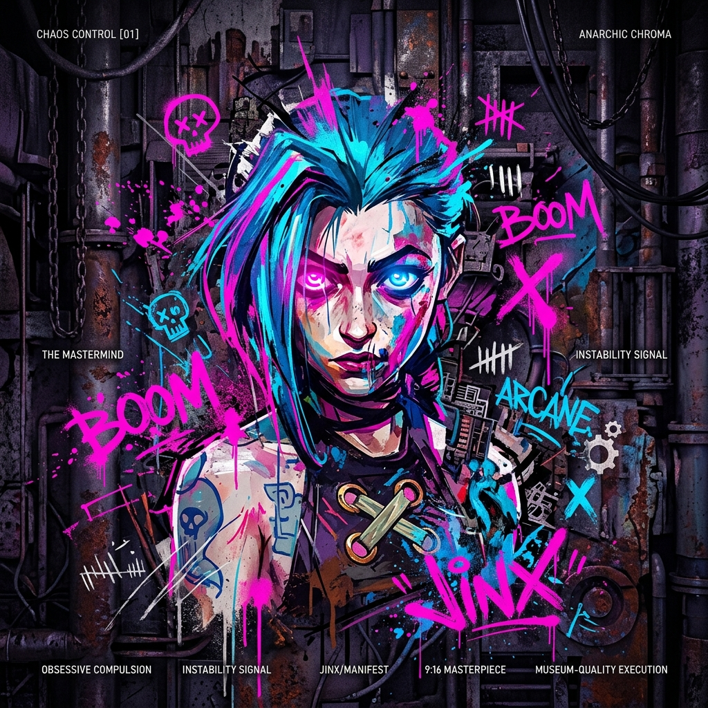
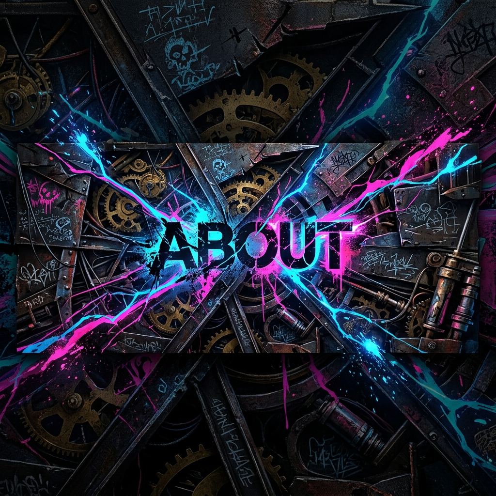
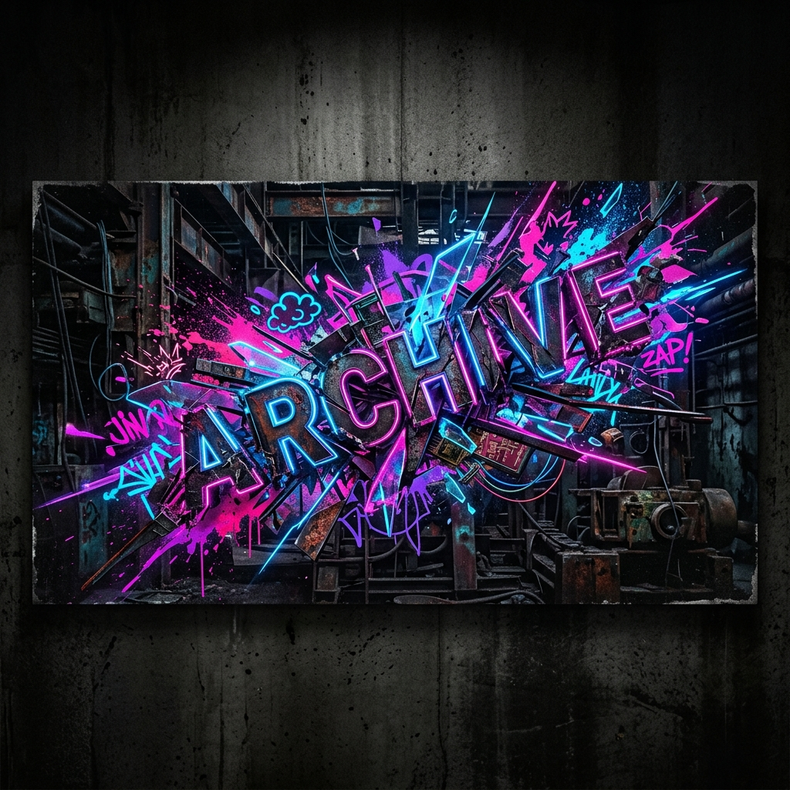
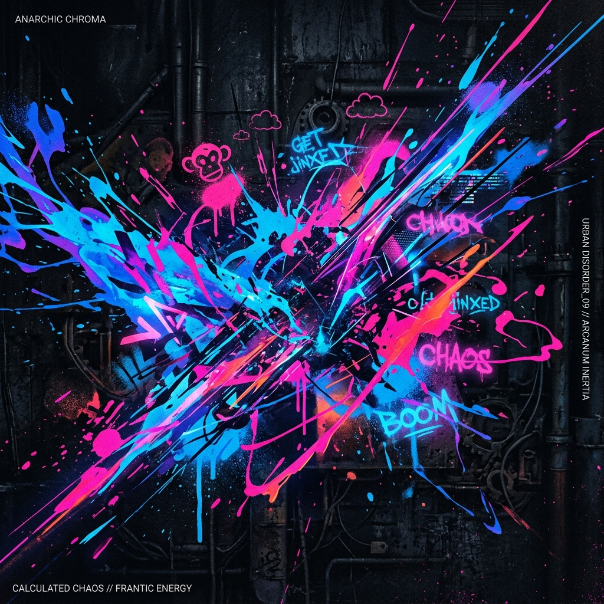
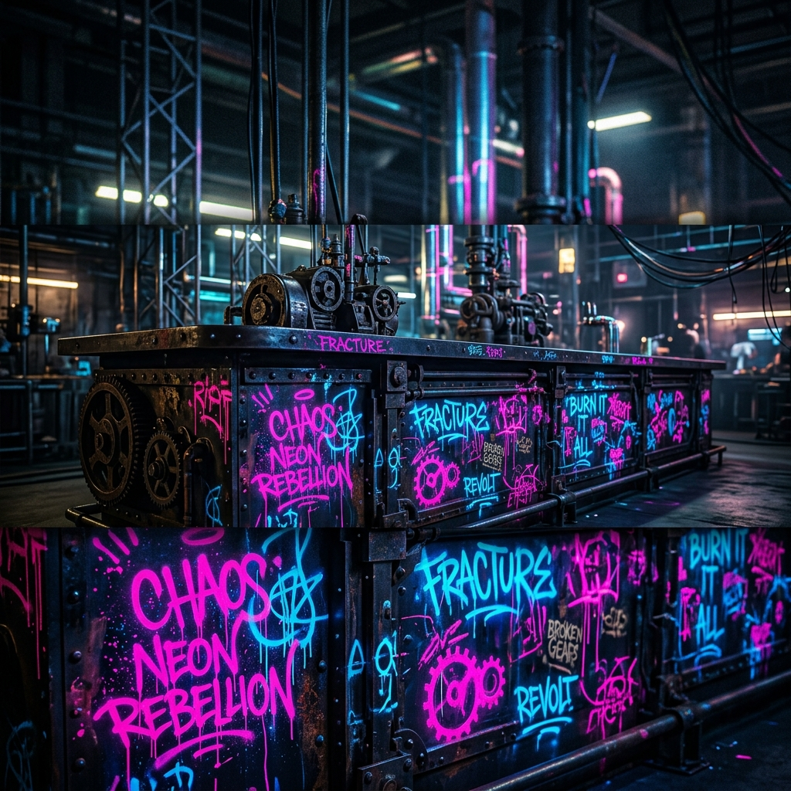
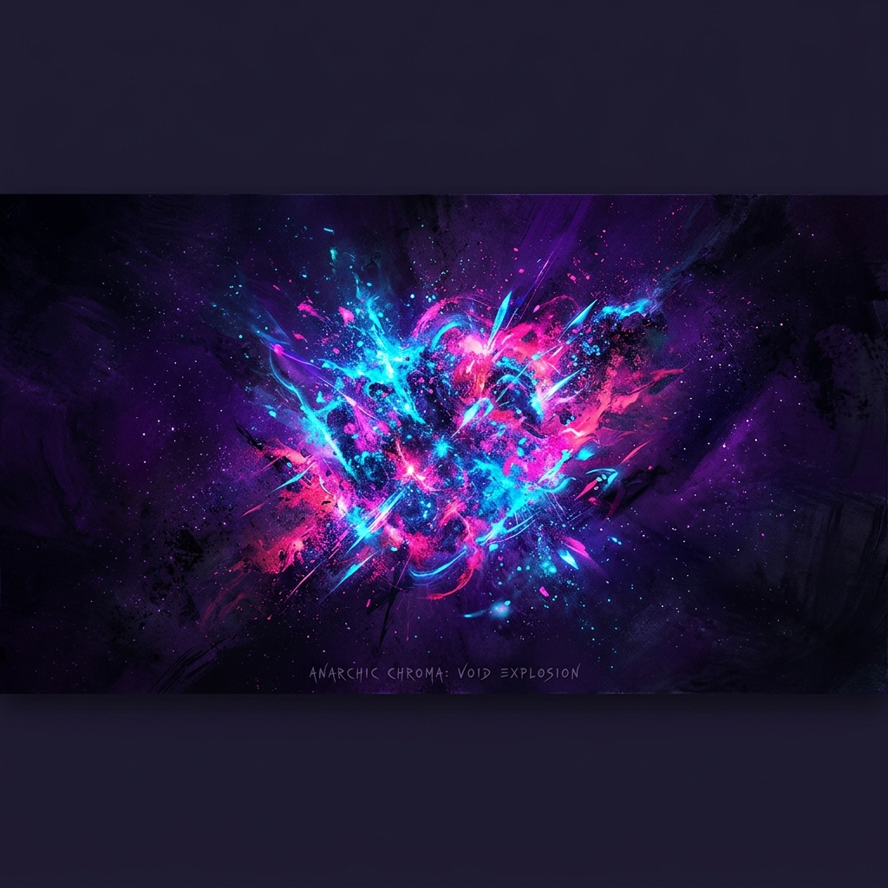

  

 

 
 
 

- Name: **Eunich John**.

- From: **Metro Manila, Philippines**.

- Currently: studying **BSIT- Mobile and Web Application** at **NU - Manila**.

- Off the clock: **Deadlock Player!**.

 

  
  
  
  
  
  
  
  
  
  
  
  
  
  
  
  
  
  
  
  
  
  
  
  
  
  
  
  
  
  
  
  
  
  
  
  
  
  
  
  
  
  
  
  
  
  
  

 
 

 
 
  

  
  

 

  

 

<picture>
  <source media="(prefers-color-scheme: dark)" srcset="https://raw.githubusercontent.com/gamothalaman090-jpg/gamothalaman090-jpg/pacman-output/pacman-contribution-graph-dark.svg?v=1">
  <source media="(prefers-color-scheme: light)" srcset="https://raw.githubusercontent.com/gamothalaman090-jpg/gamothalaman090-jpg/pacman-output/pacman-contribution-graph.svg?v=1">
  
</picture>

 
 
“I'm not crazy, my reality is just different than yours.” – Jinx&nbsp;&nbsp;&nbsp;&nbsp;&nbsp;&nbsp;&nbsp;&nbsp;&nbsp;&nbsp;&nbsp;&nbsp;&nbsp;&nbsp;&nbsp;&nbsp;&nbsp;&nbsp;&nbsp;&nbsp;&nbsp;&nbsp;&nbsp;&nbsp;&nbsp;&nbsp;&nbsp;&nbsp;&nbsp;&nbsp;&nbsp;&nbsp;&nbsp;&nbsp;&nbsp;&nbsp;&nbsp;&nbsp;&nbsp;&nbsp;&nbsp;&nbsp;&nbsp;&nbsp;&nbsp;&nbsp;&nbsp;&nbsp;&nbsp;&nbsp;&nbsp;&nbsp;&nbsp;&nbsp;&nbsp;&nbsp;&nbsp;
  

  
  
  
  
  

